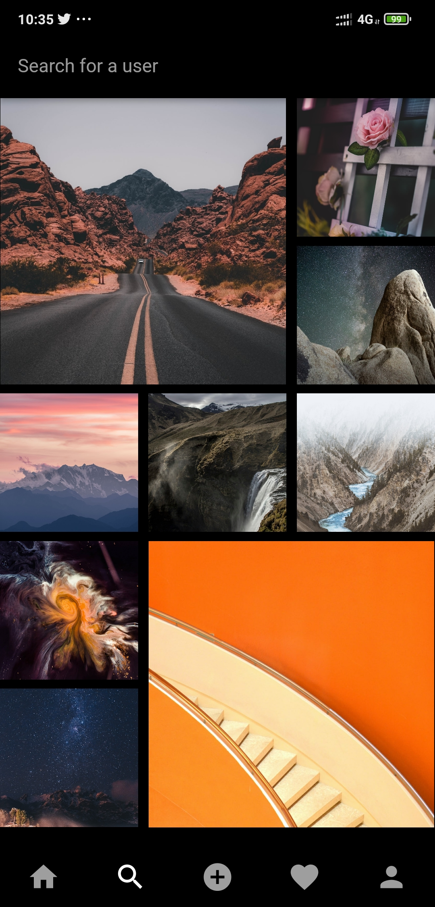
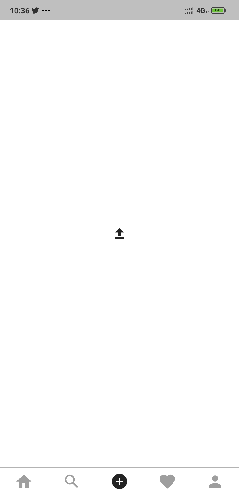
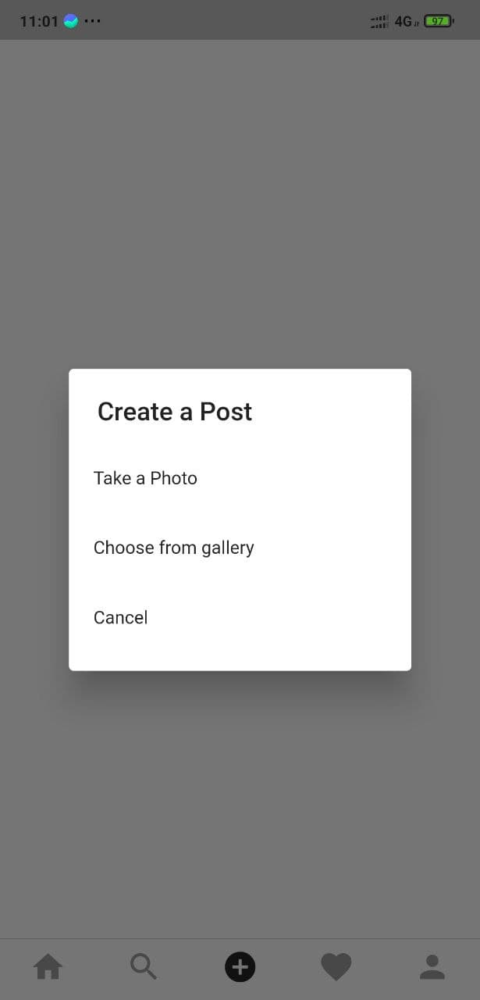

# 📸 Instagram Clone

## 🖼️ Screenshots

<div align="center">

&nbsp;
&nbsp;
&nbsp;

</div>

---

> 🚀 Built with **Ionic 8 + Vue** — A pixel-perfect Instagram Clone experience.

## 📋 Spesifikasi Minimum

- **Node.js**: v18.0 atau lebih tinggi
- **npm**: v9.0 atau lebih tinggi
- **Ionic CLI**: v8.0 atau lebih tinggi

## 🔧 Instalasi

pengguna dapat mengikuti langkah-langkah berikut untuk menjalankan aplikasi ini secara lokal:

PENTING:
env dapat diambil dari link drive pada folder 
"Technical Test_Bagian 2_pertanyaan 2"

1. Clone repository:
```bash
git clone <repository-url>
cd test-appsinsta
```

2. Install dependencies:
```bash
npm install
```

3. Install Ionic CLI (jika belum):
```bash
npm install -g @ionic/cli
```

## ▶️ Menjalankan Aplikasi

Untuk development:
```bash
npm run dev
```

Untuk build production:
```bash
npm run build
```

Untuk test di device/emulator:
```bash
ionic capacitor run android
ionic capacitor run ios
```

